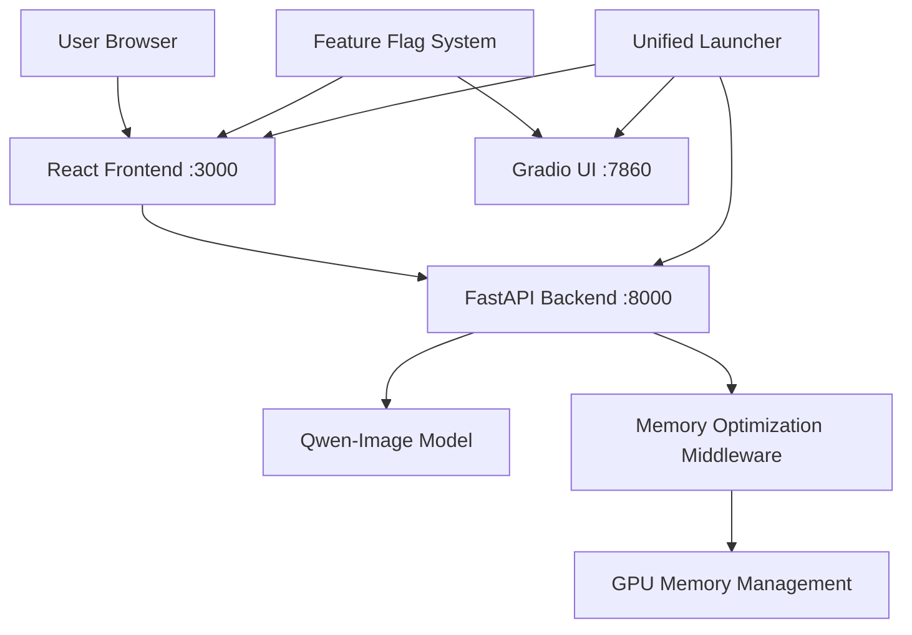

# FastAPI + React Deployment Guide

## Overview

This guide covers deployment of the modernized Qwen-Image Generator with FastAPI backend and React frontend, featuring advanced memory optimization and professional UI/UX.

## Architecture



## Quick Start

### 1. Prerequisites

**System Requirements:**
- Python 3.10+ (recommended)
- Node.js 16+ and npm
- CUDA 12.1+ compatible GPU (RTX 4080 or similar)
- 16GB+ VRAM, 32GB+ System RAM
- 60GB+ free disk space

**Check Prerequisites:**
```bash
python launch_unified.py --check-deps
```

### 2. Installation

**Install Python Dependencies:**
```bash
pip install -r requirements.txt
```

**Install React Dependencies:**
```bash
python launch_unified.py --install-deps
# Or manually:
cd frontend && npm install
```

### 3. Configuration

**Initialize Feature Flags:**
```bash
python src/ui_config_manager.py status
python src/ui_config_manager.py set-mode both
```

**Configure UI Selection:**
```bash
# React only
python src/ui_config_manager.py set-mode react

# Gradio only
python src/ui_config_manager.py set-mode gradio

# Both interfaces
python src/ui_config_manager.py set-mode both
```

### 4. Launch

**Unified Launcher (Recommended):**
```bash
# Launch both React and Gradio with API
python launch_unified.py --mode both

# React only with API
python launch_unified.py --mode react

# API server only
python launch_unified.py --mode api-only
```

**Manual Launch:**
```bash
# API Server (Terminal 1)
python src/api/main.py

# React Frontend (Terminal 2)
cd frontend && npm start

# Gradio UI (Terminal 3)
python src/qwen_image_ui.py
```

## Access URLs

| Service | URL | Description |
|---------|-----|-------------|
| React UI | http://localhost:3000 | Modern React interface |
| Gradio UI | http://localhost:7860 | Traditional Gradio interface |
| FastAPI Backend | http://localhost:8000 | REST API server |
| API Documentation | http://localhost:8000/docs | Interactive API docs |
| API Health Check | http://localhost:8000/health | Server health status |

## API Endpoints

### Core Endpoints

| Method | Endpoint | Description |
|--------|----------|-------------|
| GET | `/` | API information |
| GET | `/health` | Health check |
| GET | `/status` | Model and system status |
| POST | `/initialize` | Initialize Qwen-Image model |

### Generation Endpoints

| Method | Endpoint | Description |
|--------|----------|-------------|
| POST | `/generate/text-to-image` | Generate image from text |
| POST | `/generate/image-to-image` | Transform image with text |
| GET | `/aspect-ratios` | Available aspect ratios |

### Management Endpoints

| Method | Endpoint | Description |
|--------|----------|-------------|
| GET | `/queue` | Queue status |
| DELETE | `/queue/{job_id}` | Cancel queued job |
| GET | `/memory/clear` | Clear GPU memory |
| GET | `/images/{filename}` | Serve generated images |

### Example API Usage

**Text-to-Image Generation:**
```bash
curl -X POST "http://localhost:8000/generate/text-to-image" \
     -H "Content-Type: application/json" \
     -d '{
       "prompt": "A futuristic coffee shop with neon signs",
       "width": 1664,
       "height": 928,
       "num_inference_steps": 50,
       "cfg_scale": 4.0,
       "seed": -1,
       "language": "en",
       "enhance_prompt": true
     }'
```

**Check Status:**
```bash
curl http://localhost:8000/status
```

## Memory Optimization Features

### Automatic Memory Management

The FastAPI backend includes sophisticated memory optimization:

1. **Request-Level Cleanup:** Automatic GPU memory clearing after each request
2. **Background Monitoring:** Continuous memory usage monitoring
3. **Threshold Management:** Proactive cleanup when memory usage exceeds 85%
4. **Emergency Cleanup:** Aggressive cleanup on errors or high memory pressure

### Memory Middleware Configuration

```python
# In src/api/main.py
from src.api.middleware import MemoryOptimizationMiddleware

app.add_middleware(
    MemoryOptimizationMiddleware,
    memory_threshold=0.85,     # 85% VRAM usage threshold
    cleanup_interval=30,       # Background cleanup every 30s
    enable_monitoring=True     # Enable continuous monitoring
)
```

### Manual Memory Management

**Clear Memory via API:**
```bash
curl http://localhost:8000/memory/clear
```

**Monitor Memory Usage:**
```bash
curl http://localhost:8000/status | jq '.memory_info'
```

## Feature Flag System

### Configuration File

Feature flags are stored in `config/ui_config.json`:

```json
{
  "ui_mode": "both",
  "gradio": {
    "enabled": true,
    "port": 7860,
    "host": "0.0.0.0"
  },
  "react": {
    "enabled": true,
    "dev_port": 3000
  },
  "api": {
    "enabled": true,
    "port": 8000,
    "auto_start": true
  },
  "features": {
    "memory_optimization": true,
    "request_queuing": true,
    "performance_monitoring": true
  }
}
```

### Feature Management Commands

```bash
# Show current configuration
python src/ui_config_manager.py status

# Enable/disable features
python src/ui_config_manager.py feature memory_optimization enable
python src/ui_config_manager.py feature request_queuing disable

# Set ports
python src/ui_config_manager.py set-port api 8080
python src/ui_config_manager.py set-port react 3001

# Launch with configuration
python src/ui_config_manager.py launch --background
```

## React Frontend Features

### Modern UI Components

- **Responsive Design:** Mobile-friendly interface with Tailwind CSS
- **Real-time Status:** Live GPU memory monitoring and generation status
- **Advanced Controls:** Full parameter control with presets and examples
- **Image Management:** Download, fullscreen, and metadata viewing
- **Queue Management:** Visual queue status and job cancellation

### Component Architecture

```
src/components/
├── Header.tsx           # Navigation and branding
├── StatusBar.tsx        # System status and memory monitoring
├── GenerationPanel.tsx  # Image generation controls
└── ImageDisplay.tsx     # Results and image management
```

### Development

**Start Development Server:**
```bash
cd frontend
npm start
```

**Build for Production:**
```bash
cd frontend
npm run build
```

**Linting and Formatting:**
```bash
cd frontend
npm run lint
npm run format
```

## Production Deployment

### Environment Variables

```bash
# API Configuration
export QWEN_API_HOST=0.0.0.0
export QWEN_API_PORT=8000
export QWEN_API_WORKERS=1

# React Configuration
export REACT_APP_API_URL=http://your-domain:8000
export PORT=3000

# Memory Settings
export PYTORCH_CUDA_ALLOC_CONF=expandable_segments:True
export CUDA_VISIBLE_DEVICES=0
```

### Docker Deployment

**Dockerfile for API:**
```dockerfile
FROM nvidia/cuda:12.1-devel-ubuntu22.04

# Install Python and dependencies
RUN apt-get update && apt-get install -y python3 python3-pip
COPY requirements.txt .
RUN pip3 install -r requirements.txt

# Copy application
COPY src/ ./src/
COPY models/ ./models/

# Expose port
EXPOSE 8000

# Start API
CMD ["python3", "src/api/main.py"]
```

**Dockerfile for React:**
```dockerfile
FROM node:18-alpine

# Set working directory
WORKDIR /app

# Copy package files
COPY frontend/package*.json ./
RUN npm install

# Copy source code
COPY frontend/ ./

# Build for production
RUN npm run build

# Install serve
RUN npm install -g serve

# Expose port
EXPOSE 3000

# Start React app
CMD ["serve", "-s", "build", "-l", "3000"]
```

**Docker Compose:**
```yaml
version: '3.8'
services:
  qwen-api:
    build:
      context: .
      dockerfile: Dockerfile.api
    ports:
      - "8000:8000"
    runtime: nvidia
    environment:
      - CUDA_VISIBLE_DEVICES=0
    volumes:
      - ./generated_images:/app/generated_images
      - ./models:/app/models

  qwen-react:
    build:
      context: .
      dockerfile: Dockerfile.react
    ports:
      - "3000:3000"
    environment:
      - REACT_APP_API_URL=http://localhost:8000
    depends_on:
      - qwen-api
```

### Nginx Configuration

```nginx
server {
    listen 80;
    server_name your-domain.com;

    # React frontend
    location / {
        proxy_pass http://localhost:3000;
        proxy_set_header Host $host;
        proxy_set_header X-Real-IP $remote_addr;
    }

    # API backend
    location /api/ {
        proxy_pass http://localhost:8000/;
        proxy_set_header Host $host;
        proxy_set_header X-Real-IP $remote_addr;
        proxy_connect_timeout 300s;
        proxy_send_timeout 300s;
        proxy_read_timeout 300s;
    }

    # Serve generated images
    location /images/ {
        alias /path/to/generated_images/;
        expires 1d;
        add_header Cache-Control "public, immutable";
    }
}
```

## Testing and Validation

### API Testing

**Comprehensive Test Suite:**
```bash
python test_fastapi_endpoints.py
```

**Individual Endpoint Tests:**
```bash
# Test health
curl http://localhost:8000/health

# Test generation
curl -X POST http://localhost:8000/generate/text-to-image \
     -H "Content-Type: application/json" \
     -d '{"prompt": "test image", "width": 832, "height": 832}'
```

### React Frontend Testing

```bash
cd frontend
npm test
```

### Performance Testing

**Load Testing with Artillery:**
```bash
npm install -g artillery
artillery run performance-test.yml
```

**Memory Monitoring:**
```bash
# Monitor during load
watch -n 1 'curl -s http://localhost:8000/status | jq .memory_info'
```

## Troubleshooting

### Common Issues

**1. API Connection Errors**
```bash
# Check if API is running
curl http://localhost:8000/health

# Check logs
python src/api/main.py
```

**2. CUDA Out of Memory**
```bash
# Clear GPU memory
curl http://localhost:8000/memory/clear

# Check memory usage
nvidia-smi
```

**3. React Build Errors**
```bash
# Clear node modules and reinstall
cd frontend
rm -rf node_modules package-lock.json
npm install
```

**4. Model Loading Issues**
```bash
# Test model initialization
curl -X POST http://localhost:8000/initialize

# Check disk space
df -h
```

### Performance Optimization

**GPU Memory:**
- Enable memory optimizations in feature flags
- Use smaller batch sizes for generation
- Clear memory between requests

**API Performance:**
- Enable request queuing for concurrent requests
- Use background tasks for cleanup
- Monitor memory thresholds

**React Performance:**
- Use production build for deployment
- Enable service workers for caching
- Optimize image loading and display

## Migration from Gradio

### Gradual Migration

1. **Phase 1:** Deploy FastAPI alongside existing Gradio
2. **Phase 2:** Test React frontend with API backend
3. **Phase 3:** Switch default UI to React
4. **Phase 4:** Deprecate Gradio (optional)

### Feature Comparison

| Feature | Gradio | React + FastAPI |
|---------|---------|-----------------|
| UI Framework | Gradio Blocks | React + Tailwind |
| Backend | Integrated | FastAPI (REST API) |
| Memory Management | Basic | Advanced middleware |
| Request Queuing | Limited | Full queue management |
| Customization | Limited | Fully customizable |
| Performance Monitoring | None | Built-in metrics |
| Mobile Support | Basic | Responsive design |
| API Access | None | Full REST API |

### Data Migration

No data migration is required. Both interfaces share:
- Generated images directory
- Model cache
- Configuration files
- Memory optimization tools

## Monitoring and Maintenance

### Health Monitoring

**API Health Check:**
```bash
curl http://localhost:8000/health
```

**Memory Monitoring:**
```bash
curl http://localhost:8000/status | jq '.memory_info'
```

### Log Monitoring

**API Logs:**
- FastAPI automatically logs requests and errors
- Enable detailed logging in production

**Application Logs:**
- Check console output for model loading
- Monitor GPU memory usage patterns

### Backup and Recovery

**Model Files:**
- Backup model cache directory (`./models/`)
- Generated images (`./generated_images/`)

**Configuration:**
- Backup `config/ui_config.json`
- Export feature flag settings

## Support and Resources

### Documentation
- FastAPI Documentation: http://localhost:8000/docs
- React Component Docs: `frontend/src/components/`
- API Reference: This document

### Performance Tuning
- Memory optimization guide: `docs/CUDA_MEMORY_IMPLEMENTATION_PLAN.md`
- GPU monitoring tools: `tools/test_device.py`

### Community
- Report issues with detailed error messages
- Include system specifications and logs
- Test with minimal reproduction cases

---

## Conclusion

The FastAPI + React architecture provides a modern, scalable, and professional-grade deployment option for the Qwen-Image Generator. With advanced memory optimization, real-time monitoring, and flexible UI selection, this deployment supports both development and production environments effectively.

For additional support, refer to the troubleshooting section or check the comprehensive test suite results.
